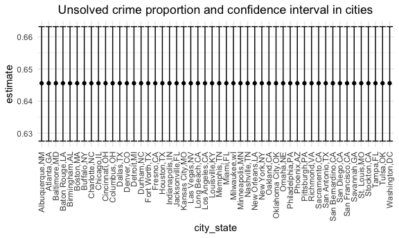
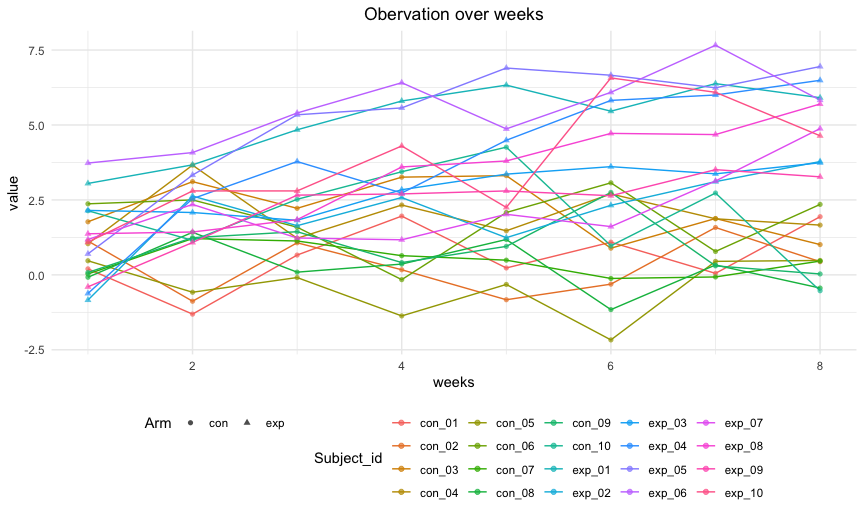

p8105\_hw5\_js5962
================

## Problem 1

1.  Import the data and clean.

``` r
homicide_df =
  read.csv("homicide-data.csv", na = c("", "Unknown")) 
```

Describe the raw data: The dataset homicide\_data is collected by *The
Washington Post* on homicides in 50 large U.S. cities. The data contains
52179 rows and 12 columns. Each row represents one case. Variables
describe the report data, location, victim’s information and disposition
od the cases.

``` r
homicide_clean =
  homicide_df %>% 
  mutate(city_state = str_c(city, ",", state),#create variable
         result = case_when(
           disposition == "Closed without arrest" ~ "unsolved",
           disposition == "Open/No arrest" ~ "unsolved",
           disposition == "Closed by arrest" ~ "solved"
         )) %>% 
  relocate(city_state) %>% 
  filter(city_state != "Tulsa,AL") 
homicide_clean %>% 
  select(-city, -state) %>% #summarize numbers
  group_by(city_state) %>% 
  summarize(unsolved = sum(result == "unsolved"),#summarize numbers
            n = n()) %>% 
  knitr::kable()
```

| city\_state       | unsolved |    n |
|:------------------|---------:|-----:|
| Albuquerque,NM    |      146 |  378 |
| Atlanta,GA        |      373 |  973 |
| Baltimore,MD      |     1825 | 2827 |
| Baton Rouge,LA    |      196 |  424 |
| Birmingham,AL     |      347 |  800 |
| Boston,MA         |      310 |  614 |
| Buffalo,NY        |      319 |  521 |
| Charlotte,NC      |      206 |  687 |
| Chicago,IL        |     4073 | 5535 |
| Cincinnati,OH     |      309 |  694 |
| Columbus,OH       |      575 | 1084 |
| Dallas,TX         |      754 | 1567 |
| Denver,CO         |      169 |  312 |
| Detroit,MI        |     1482 | 2519 |
| Durham,NC         |      101 |  276 |
| Fort Worth,TX     |      255 |  549 |
| Fresno,CA         |      169 |  487 |
| Houston,TX        |     1493 | 2942 |
| Indianapolis,IN   |      594 | 1322 |
| Jacksonville,FL   |      597 | 1168 |
| Kansas City,MO    |      486 | 1190 |
| Las Vegas,NV      |      572 | 1381 |
| Long Beach,CA     |      156 |  378 |
| Los Angeles,CA    |     1106 | 2257 |
| Louisville,KY     |      261 |  576 |
| Memphis,TN        |      483 | 1514 |
| Miami,FL          |      450 |  744 |
| Milwaukee,wI      |      403 | 1115 |
| Minneapolis,MN    |      187 |  366 |
| Nashville,TN      |      278 |  767 |
| New Orleans,LA    |      930 | 1434 |
| New York,NY       |      243 |  627 |
| Oakland,CA        |      508 |  947 |
| Oklahoma City,OK  |      326 |  672 |
| Omaha,NE          |      169 |  409 |
| Philadelphia,PA   |     1360 | 3037 |
| Phoenix,AZ        |      504 |  914 |
| Pittsburgh,PA     |      337 |  631 |
| Richmond,VA       |      113 |  429 |
| Sacramento,CA     |      139 |  376 |
| San Antonio,TX    |      357 |  833 |
| San Bernardino,CA |      170 |  275 |
| San Diego,CA      |      175 |  461 |
| San Francisco,CA  |      336 |  663 |
| Savannah,GA       |      115 |  246 |
| St. Louis,MO      |      905 | 1677 |
| Stockton,CA       |      266 |  444 |
| Tampa,FL          |       95 |  208 |
| Tulsa,OK          |      193 |  583 |
| Washington,DC     |      589 | 1345 |

2.  use the prop.test function to estimate the proportion of homicides
    that are unsolved in the city of Baltimore, MD.

``` r
baltimore_df = homicide_clean %>% 
  filter(city_state == "Baltimore,MD")

baltimore_unsolved =     
  baltimore_df %>% 
  summarize(unsolved = sum(result == "unsolved"),
            n = n())
baltimore_prop =
  prop.test(x = baltimore_unsolved %>% pull(unsolved), 
          n = baltimore_unsolved %>% pull(n))
tidy_df = baltimore_prop %>% 
  broom::tidy()
tidy_df
```

    ## # A tibble: 1 × 8
    ##   estimate statistic  p.value parameter conf.low conf.high method    alternative
    ##      <dbl>     <dbl>    <dbl>     <int>    <dbl>     <dbl> <chr>     <chr>      
    ## 1    0.646      239. 6.46e-54         1    0.628     0.663 1-sample… two.sided

``` r
# pull the estimated proportion and confidence intervals from the resulting tidy dataframe
tidy_df %>% 
  select(estimate, conf.low, conf.high)
```

    ## # A tibble: 1 × 3
    ##   estimate conf.low conf.high
    ##      <dbl>    <dbl>     <dbl>
    ## 1    0.646    0.628     0.663

3.  Run prop.test for each of the cities in your dataset, and extract
    both the proportion of unsolved homicides and the confidence
    interval for each.

Firstly build the function.

``` r
prop_test = function(city_df){
  
  city_unsolved =     
  city_df %>% 
  summarize(unsolved = sum(result == "unsolved"),
            n = n())
  
city_prop =
  prop.test(x = baltimore_unsolved %>% pull(unsolved), 
          n = baltimore_unsolved %>% pull(n))
return(city_prop)
}
```

We iterate by mapping.

``` r
result_df =
  homicide_clean %>% 
  nest(data = uid:result) %>% 
  mutate(
    test_result = purrr::map(data, prop_test),
    tidy_result = purrr::map(test_result, broom::tidy)
  ) %>% 
  select(city_state, tidy_result) %>% 
  unnest(tidy_result) %>% 
  select(city_state, estimate, conf.low, conf.high)
show(result_df)
```

    ## # A tibble: 50 × 4
    ##    city_state     estimate conf.low conf.high
    ##    <chr>             <dbl>    <dbl>     <dbl>
    ##  1 Albuquerque,NM    0.646    0.628     0.663
    ##  2 Atlanta,GA        0.646    0.628     0.663
    ##  3 Baltimore,MD      0.646    0.628     0.663
    ##  4 Baton Rouge,LA    0.646    0.628     0.663
    ##  5 Birmingham,AL     0.646    0.628     0.663
    ##  6 Boston,MA         0.646    0.628     0.663
    ##  7 Buffalo,NY        0.646    0.628     0.663
    ##  8 Charlotte,NC      0.646    0.628     0.663
    ##  9 Chicago,IL        0.646    0.628     0.663
    ## 10 Cincinnati,OH     0.646    0.628     0.663
    ## # … with 40 more rows

use map2.

``` r
result_df2 =
  homicide_clean %>% 
  select(-city, -state) %>% 
  group_by(city_state) %>% 
  summarize(unsolved = sum(result == "unsolved"),
            n = n()) %>% 
  mutate(
    test_result = purrr::map2(unsolved, n, prop.test),
    tidy_result = purrr::map(test_result, broom::tidy)
  ) %>% 
  select(city_state, tidy_result) %>% 
  unnest(tidy_result) %>% 
  select(city_state, estimate, conf.low, conf.high)
show(result_df2)
```

    ## # A tibble: 50 × 4
    ##    city_state     estimate conf.low conf.high
    ##    <chr>             <dbl>    <dbl>     <dbl>
    ##  1 Albuquerque,NM    0.386    0.337     0.438
    ##  2 Atlanta,GA        0.383    0.353     0.415
    ##  3 Baltimore,MD      0.646    0.628     0.663
    ##  4 Baton Rouge,LA    0.462    0.414     0.511
    ##  5 Birmingham,AL     0.434    0.399     0.469
    ##  6 Boston,MA         0.505    0.465     0.545
    ##  7 Buffalo,NY        0.612    0.569     0.654
    ##  8 Charlotte,NC      0.300    0.266     0.336
    ##  9 Chicago,IL        0.736    0.724     0.747
    ## 10 Cincinnati,OH     0.445    0.408     0.483
    ## # … with 40 more rows

4.  Create a plot that shows the estimates and CIs for each city.

``` r
result_df %>% 
  mutate(
    city_state = fct_reorder(city_state, estimate)
    ) %>% 
   ggplot(aes(x = city_state, y = estimate)) +
   geom_point() +
   geom_errorbar(aes(ymin = conf.low, ymax = conf.high)) +
   theme(axis.text.x = element_text(angle = 90, vjust = 0.5, hjust = 1)) +
   labs(title = "Unsolved crime proportion and confidence interval in cities") +
  theme(plot.title = element_text(hjust = 0.5))
```



## Problem 2

Start with a dataframe containing all file names; the list.files
function will help

``` r
longi_df = tibble(
  file_name = list.files("longitudinal study")
)
```

Now build a read data function

``` r
read_data = function(name) {
  path = str_c("./longitudinal study/", name)
  data = read.csv(path)
  return(data)
}
```

Iterate over file names and read in data for each subject using
purrr::map and saving the result as a new variable in the dataframe

``` r
new_df = longi_df %>% 
  mutate(
    newlist = purrr::map(.x = as.character(file_name), ~read_data(.x))
    ) %>% 
  unnest(newlist) %>% 
#Tidy the result
  mutate(
    subject_id = substr(file_name, 1, 6),
    arm = substr(file_name, 1, 3)
  ) %>% 
  select(-file_name) %>% 
  relocate(subject_id, arm) %>% 
  janitor::clean_names() %>% 
  drop_na() %>% 
  pivot_longer(
    cols = week_1:week_8,
    names_to = "week",
    values_to = "value"
  ) %>% 
  mutate(week = substr(week, 6, 6))
```

Make a spaghetti plot showing observations on each subject over time,
and comment on differences between groups.

``` r
new_df %>% 
  ggplot(aes(x = as.numeric(week), y = value, color = as.factor(subject_id))) +
  geom_line() + geom_point(aes(shape = as.factor(arm)), alpha = 0.7) +
  labs(title = "Obervation over weeks") +
  scale_colour_hue("Subject_id") +
  scale_shape("Arm")
```



comment

## Problem 3

``` r
library(tidyverse)

set.seed(10)

iris_with_missing = iris %>% 
  map_df(~replace(.x, sample(1:150, 20), NA)) %>%
  mutate(Species = as.character(Species))
```

refill missing data function

``` r
refill_miss = function(miss) {
  
  if(is.numeric(miss)) {
    mean_miss = round(mean(miss, na.rm = TRUE), digits = 2)
    miss = replace_na(miss, mean_miss)
  }
  
  if (is.character(miss)) {
    miss = replace_na(miss, "virginica")
  }
  return(miss)
}
```

Then Refill and Build the new data

``` r
iris_new = map(iris_with_missing, missing) %>% 
  bind_cols()
iris_new
```

    ## # A tibble: 1 × 5
    ##   Sepal.Length Sepal.Width Petal.Length Petal.Width Species
    ##   <lgl>        <lgl>       <lgl>        <lgl>       <lgl>  
    ## 1 FALSE        FALSE       FALSE        FALSE       FALSE
